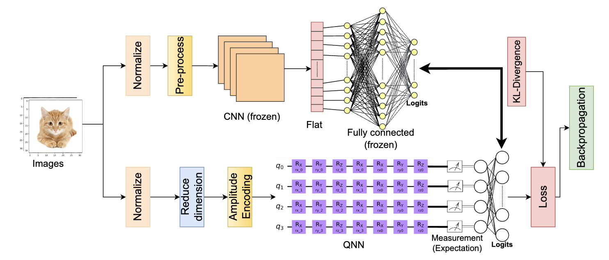
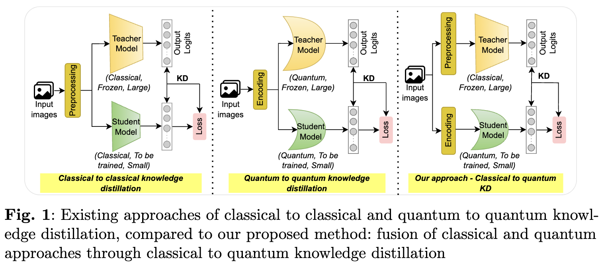
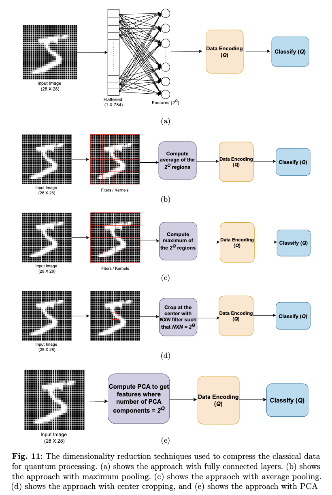
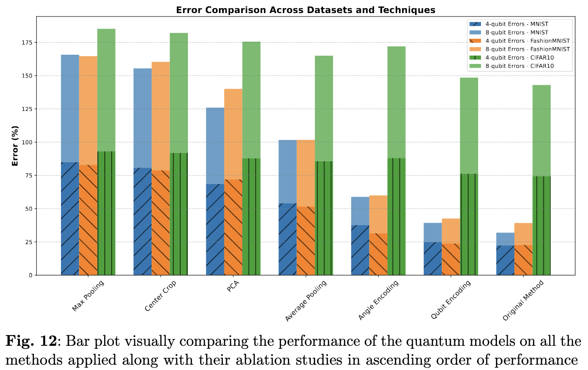

# Bridging Classical and Quantum Machine Learning 

[](https://arxiv.org/abs/2311.13810)

This repository contains the code and experiments for the paper "Bridging Classical and Quantum Machine Learning: Knowledge Transfer From Classical to Quantum Neural Networks Using Knowledge Distillation".

---

## Table of Contents

1. [Motivation](#motivation)  
2. [Architecture and Approach](#architecture-and-approach)  
   - [Knowledge Distillation Method](#knowledge-distillation-method)  
   - [Dimensionality Techniques](#dimensionality-techniques)  
3. [Project Structure](#project-structure)  
4. [Installation and Setup](#installation-and-setup)  
5. [Usage](#usage)  
6. [Experiments](#experiments)  
   - [MNIST](#mnist)  
   - [FashionMNIST](#fashionmnist)  
7. [Results](#results)  
8. [Citation](#citation)  
9. [License](#license)  

---

## Motivation

Quantum neural networks have shown promise in surpassing classical neural networks in tasks like image classification when using a similar number of learnable parameters. However, the development and optimization of quantum models face challenges such as qubit instability and limited availability. This project introduces a novel method to transfer knowledge from classical to quantum neural networks using knowledge distillation, effectively bridging the gap between classical machine learning and emerging quantum computing techniques.

Our approach adapts classical convolutional neural network (CNN) architectures like LeNet and AlexNet to serve as teacher networks, facilitating the training of student quantum models. This method yields significant performance improvements for quantum models by solely depending on classical CNNs, eliminating the need for cumbersome training of large quantum models in resource-constrained settings.

---

## Architecture and Approach

### Knowledge Distillation Method

In our paper, “Bridging Classical and Quantum Machine Learning: Knowledge Transfer From Classical to Quantum Neural Networks Using Knowledge Distillation,” we show how a **frozen classical CNN** (teacher) transfers knowledge to a **smaller quantum network** (student). Below is a high-level diagram illustrating the overall training scheme:



We compare our **classical-to-quantum** knowledge distillation approach to (1) classical-to-classical and (2) quantum-to-quantum distillation methods:



1. **Teacher Model (Classical, Frozen)**  
   - Typically a large CNN (e.g., LeNet, AlexNet).  
2. **Student Model (Quantum, Trainable)**  
   - A QNN with significantly fewer trainable parameters.  
3. **Distillation Loss**  
   - Minimizes KL divergence between teacher’s and student’s output logits.

### Dimensionality Techniques

Because quantum circuits can only handle a limited number of qubits, we must **reduce input dimensionality** before encoding data into a quantum circuit. We experiment with several strategies:



1. **Fully Connected (Flatten + FC):**  
   - Flatten the image, project to \(2^Q\) features for \(Q\) qubits.  
2. **Average/Max Pooling:**  
   - Divide the image into \(2^Q\) regions and pool values.  
3. **Center Crop:**  
   - Crop the central \(N \times N\) patch with \(N^2 = 2^Q\).  
4. **PCA:**  
   - Use Principal Component Analysis to extract \(2^Q\) components.

Below is an example of the **error rates** for different dimensionality strategies across MNIST, FashionMNIST, and CIFAR10 for 4-qubit and 8-qubit QNNs:



---


## Project Structure

```
├── MNIST Experiments
│   ├── Teachers                       # Classical CNN teacher notebooks
│   ├── Baseline students             # Quantum students without distillation
│   └── Distillation on students      # Quantum students with knowledge distillation
├── FashionMNIST Experiments
│   ├── Teachers
│   ├── Baseline students
│   └── Distillation on students
├── ss1.png                            # Architecture diagram
├── ss2.png                            # Motivation & method comparison diagram
├── ss3.png                            # Dimensionality reduction methods
├── ss4.png                            # Error comparison chart
└── README.md                          # You are here!
```

---

## Installation and Setup

To run the experiments, you need:

- **Python 3.7 or higher**
- **PyTorch 1.8 or higher**
- **Qiskit 0.25 or higher**  
- **TorchQuantum 0.1.0 or higher**
- **Jupyter Notebook or Jupyter Lab**

### Quick Installation

```bash
pip install torch            # For PyTorch
pip install qiskit           # For Qiskit
pip install torchquantum     # For TorchQuantum
pip install jupyter          # For notebooks
```

### Optional: Virtual Environment

It’s recommended to use a virtual environment:
```bash
python -m venv venv
source venv/bin/activate  # or venv\Scripts\activate on Windows
```
Then proceed with the installations within your virtual environment.

---

## Usage

1. **Clone the Repository**  
   ```bash
   git clone https://github.com/your_username/quantum-machine-learning.git
   cd quantum-machine-learning
   ```

2. **Launch Jupyter**  
   ```bash
   jupyter notebook  # or jupyter lab
   ```
3. **Open Notebooks**  
   - `MNIST Experiments` or `FashionMNIST Experiments` notebooks (for classical teacher training, baseline quantum models, and knowledge-distilled quantum models).

If you prefer **Google Colab**, simply upload the notebooks and select the appropriate runtime.

---

## Experiments

### MNIST

1. **Teachers**  
   - Train classical CNNs (LeNet, etc.) on MNIST.  
2. **Baseline Students**  
   - Train quantum models without using distillation.  
3. **Distillation on Students**  
   - Transfer knowledge from the frozen classical teacher to the quantum student.

### FashionMNIST

Follow the same process as MNIST but with FashionMNIST data:
1. **Teachers**  
2. **Baseline Students**  
3. **Distillation on Students**  

These steps highlight how knowledge distillation improves QNN accuracy across different datasets.

---

## Results

- **MNIST**: Average quantum model accuracy improves by **0.80%** with distillation.  
- **FashionMNIST**: Average quantum model accuracy improves by **5.40%** with distillation.  
- **CIFAR10** (in some ablation studies): Also shows enhancement, although absolute performance is more challenging due to dataset complexity.

Refer to the **Error Comparison** chart (`ss4.png`) for a visual summary of various dimensionality reduction strategies and 4-qubit/8-qubit experiments.

---

## Citation

If you find this repository useful in your research, please consider citing our work:

```bibtex
@article{hasan2023bridging,
  title={Bridging Classical and Quantum Machine Learning: Knowledge Transfer From Classical to Quantum Neural Networks Using Knowledge Distillation},
  author={Hasan, Mohammad Junayed and Mahdy, MRC},
  journal={arXiv preprint arXiv:2311.13810},
  year={2023}
}
```

---

## License

This project is licensed under the **MIT License**. See the [LICENSE](LICENSE) file for details.  

**Happy Quantum Coding!** If you have any questions or suggestions, feel free to open an issue or submit a pull request.

&copy; 2025 [Mohammad Junayed Hasan](https://www.linkedin.com/in/mjhasan21/)  

---
